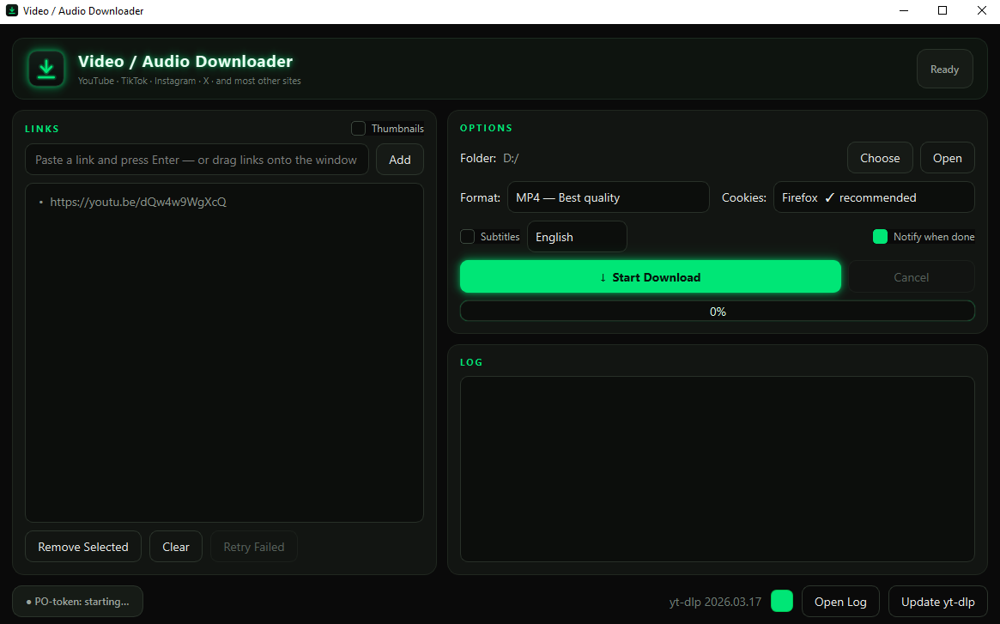

# Video / Audio Downloader

A simple, good-looking desktop app for Windows that downloads video and audio
from **YouTube, TikTok, Instagram, X, Rumble, and most other sites** — built on
[yt-dlp](https://github.com/yt-dlp/yt-dlp) with a neon-glow [PySide6](https://doc.qt.io/qtforpython/) interface.

Paste links, pick a format, hit **Start Download**. That's it.



---

## Download

**[Download the latest installer →](https://github.com/Ami2707/video-audio-downloader/releases/latest)**

1. Download `VidAudDownloader-Setup.exe` from the latest release.
2. Run it → Next, Next, Finish. It installs per-user (no admin needed) and adds a
   desktop / Start-menu icon.
3. No Python, no command line, nothing else to install.

---

## Features

- **Works with most sites** — YouTube, TikTok, Instagram, X, Rumble, and more.
- **Pick your format** — MP4 (Best / 1080p / 720p / 480p) or audio-only MP3 / WAV / M4A.
- **Batch downloads** — paste many links at once, or **drag-and-drop** them onto the window.
- **Playlist picker** — paste a YouTube playlist and tick exactly which videos you want.
- **Per-link status** — see ↓ downloading, ✓ done, ✗ failed for each link; retry just the failed ones.
- **Never freezes** — downloads run in the background with a live log, animated progress, and a Cancel button.
- **Reliable YouTube** — bundles everything modern YouTube needs (PO-token provider + JavaScript solver) so 1080p+ actually works.
- **Self-updating** — quietly keeps yt-dlp current so YouTube changes don't break it.
- **Remembers your choices** — last folder, format, theme colour, and more.
- **Customisable neon theme** — pick your own accent colour from the footer swatch.

---

## How to use

1. **Paste a link** into the box and press **Enter** (or click **Add**). You can
   also drag links straight onto the window, or paste several at once.
2. **Choose a folder** to save into (top-right **Choose** button).
3. **Pick a format** — MP4 for video, or MP3 / WAV / M4A for audio only.
4. *(Optional)* tick **Subtitles** and pick a language.
5. Click **Start Download**. Watch progress per-link; **Cancel** anytime.
6. **Double-click** a finished link to play it, or **right-click** for Copy link /
   Open source page / Reveal file / Retry / Remove.

**YouTube tip:** for the best quality and to avoid bot-checks, the app borrows
cookies from a browser you're logged into. **Firefox is the most reliable on
Windows** — see the troubleshooting section below.

---

## Run from source (for developers)

Requires **Python 3.10+** (3.12 recommended),
plus **ffmpeg** on your PATH and the bundled `runtime/` folder.

```powershell
# Install dependencies
python -m pip install -U "yt-dlp[default]" PySide6 bgutil-ytdlp-pot-provider

# Run
python VideoAudioDownloader_UI.py
```

The `[default]` extra matters — it pulls `yt-dlp-ejs`, the JavaScript solver
scripts YouTube now requires (see below). The whole app is a single file,
`VideoAudioDownloader_UI.py`.

---

## Building the installer yourself

See **[BUILD.md](BUILD.md)** for the full pipeline (PyInstaller freeze → Inno
Setup → `dist\VidAudDownloader-Setup.exe`). Short version:

```powershell
powershell -ExecutionPolicy Bypass -File .\build.ps1
```

---

## Why YouTube needs special handling

Modern YouTube fights downloaders with three compounding defences; this app
handles all of them automatically (Most other sites never needed any
of this, which is why they "just work"):

1. **Stale yt-dlp.** YouTube changes constantly; yt-dlp ships fixes weekly. The
   app self-updates yt-dlp so it stays current (or use the **Update yt-dlp** button).
2. **SABR / PO tokens.** YouTube withholds real stream URLs (and 1080p+) unless a
   *PO token* is supplied. A local PO-token provider (a bundled portable Node.js +
   the `bgutil-ytdlp-pot-provider` plugin) is auto-started — the footer shows its status.
3. **The "n challenge" (JavaScript).** YouTube scrambles stream URLs with a JS
   puzzle yt-dlp can't solve alone. The app runs the `yt-dlp-ejs` solver scripts on
   the same bundled Node.js — nothing extra to install.

> If you move the app's folder, keep the `runtime/` folder next to it — that's the
> portable Node.js used for both the PO-token provider and the JavaScript solver.

---

## Troubleshooting

- **"empty file" / "not available" / random 403s, even with the provider running:**
  you've likely hit YouTube's temporary per-IP rate-limit from too many downloads in
  a short time. Wait ~30–60 minutes; space out big batches.
- **Best quality fails / falls back to ≤360p:** the app auto-retries blocked YouTube
  links in a progressive compatibility mode so you still get *something*.
- **Cookies fail to decrypt (Chrome/Edge/Brave):** Chromium's app-bound cookie
  encryption often fails on Windows with a *"Failed to decrypt with DPAPI"* error.
  **Use Firefox** (logged into YouTube) — it's the most reliable.
- **"n challenge solving failed" / only images available:** the JavaScript solver
  scripts are missing or out of date. Reinstall with
  `python -m pip install -U "yt-dlp[default]"` (note the `[default]`).
- **PO-token provider shows "not installed":** the `runtime/` folder is missing or moved.
- **Logs:** everything is written to `downloader.log` next to the app — click
  **Open Log** in the footer to diagnose a failure.

---

## Disclaimer

This is a personal tool for downloading content you have the right to download.
You are responsible for complying with the terms of service of the sites you use
it on, and with applicable copyright law. Provided as-is, with no warranty.

## License

[MIT](LICENSE) © 2026 Ami2707